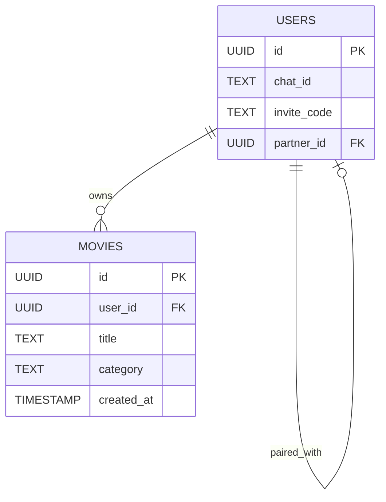

# MovieMate Telegram Bot

**MovieMateBot** is a Telegram bot designed to simplify movie planning and tracking for pairs of users. It allows two users to create a shared movie list, categorized as "Planned" or "Loved," add movies, view lists, and get random movie suggestions from their planned list. Users connect via an invite code and interact with a unified dataset stored in Supabase.

## 📘 Project Overview

- **Name**: MovieMateBot
- **Goal**: Streamline movie watching organization for pairs
- **Platform**: Telegram bot
- **Data Storage**: Supabase (PostgreSQL)
- **Language**: Python
- **Description**: Users can link with a partner using an invite code, manage a shared movie list, and receive random movie recommendations from their planned list.

## ⚙️ Features

| Command                          | Description                                      |
|----------------------------------|--------------------------------------------------|
| `/start`                         | Initializes the user                             |
| `/invite`                        | Generates an invite code for pairing             |
| `/join <code>`                   | Joins a partner using the invite code            |
| `/add <category> <movie>`        | Adds a movie to the specified category           |
| `/list <category>`               | Displays movies in the specified category        |
| `/random`                        | Suggests a random movie from the "Planned" list  |
| `/partner_status`                | Checks if the user is paired with someone        |
| `/unlink`                        | Disconnects the user from their partner          |

## 👣 User Workflow

### 🧍 User A
1. Start the bot with `/start`.
2. Generate an invite code using `/invite` (e.g., `INV-893421`).
3. Share the invite code with User B.

### 🧍‍♂️ User B
1. Start the bot with `/start`.
2. Join the pair by sending `/join INV-893421`.

### 🎉 Once Paired
- Both users can add movies to their shared list.
- View movies in either the "Planned" or "Watched" categories.
- Get random movie suggestions from the "Planned" list.
- Edit or delete movies, or change their category, all via button-based menus.
- All changes are instantly synchronized for both users.

## 🆕 Advanced Features

- **Full button-based interface**: All actions (add, edit, delete, change category, random pick) are available via Telegram buttons and menus — no need to remember commands.
- **Edit movie title and category**: Change both the name and the category (planned/loved) of any movie via interactive inline menus.
- **Delete with confirmation**: Deleting a movie always asks for confirmation via Yes/No buttons.
- **Unified edit menu**: The "Edit Movies" menu allows you to:
  - Edit movie title (choose a movie, then enter a new name)
  - Change movie category (choose a movie, then select category)
  - Delete a movie (choose a movie, then confirm)
- **Robust error handling**: All user actions and errors are logged; the bot provides clear feedback for every operation.
- **Partner-aware**: All lists and actions are always synchronized between you and your paired user.

## 📝 Example Usage (Button Flow)

1. Open the main menu and tap "✏️ Edit Movies" (or use `/editdeletemenu`).
2. See your full movie list and choose:
   - "✏️ Edit Title" — select a movie, then enter a new title.
   - "🗂️ Edit Category" — select a movie, then pick Planned/Loved.
   - "🗑️ Delete" — select a movie, then confirm deletion.
3. All changes are instantly reflected for both you and your partner.
4. Use the "🎲 Random Movie" button to get a random suggestion from your "Planned" list.
5. Use the "📜 List Movies" button to view your movies in either category.
6. Use the "🔗 Partner Status" button to check if you're paired with someone.
7. Use the "🔗 Unlink" button to disconnect from your partner.

## 📁 Project Structure

```
movieMateBot/
├── bot.py                # Entry point, dispatcher setup
├── db.py                 # (Optional) Supabase helper functions
├── keyboards.py          # Keyboard layouts (Reply/Inline)
├── requirements.txt      # Python dependencies
├── README.md             # Project documentation
├── utils.py              # Logging and utility functions
├── handlers/             # All bot logic split by domain
│   ├── __init__.py
│   ├── menu.py           # Menu and navigation handlers
│   ├── movies.py         # Movie actions: add, edit, delete, setcat, list, random
│   └── partner.py        # Partner actions: invite, join, unlink, status
└── bot.log               # Log file (auto-generated)
```

- All business logic is split by domain in the `handlers/` folder.
- `bot.py` only contains startup and handler registration.
- All keyboards and utility functions are in their own files for clarity.

## 💾 Supabase Integration

### 🗃️ Database Schema

#### Table: `users`
| Column          | Type        | Description                          |
|-----------------|-------------|--------------------------------------|
| `id`            | UUID        | Unique user ID                       |
| `chat_id`       | TEXT        | Telegram chat ID                     |
| `invite_code`   | TEXT        | Invite code for pairing              |
| `partner_id`     | UUID (FK)   | Reference to the paired user         |

#### Table: `movies`
| Column        | Type            | Description                          |
|---------------|-----------------|--------------------------------------|
| `id`          | UUID            | Unique movie ID                      |
| `user_id`     | UUID (FK)       | Reference to the user                |
| `title`       | TEXT            | Movie title                          |
| `category`    | TEXT            | Category (`planned` or `watched`)    |
| `created_at`  | TIMESTAMP       | Date the movie was added             |

## 📊 ER Diagram



- `users.partner_id`: Self-referential foreign key for pairing users.
- `movies.user_id`: Links movies to their owner.

## 🌐 TMDB API Integration

### Поиск и добавление фильмов
- При добавлении фильма пользователь вводит название, бот ищет совпадения через TMDB и предлагает выбрать нужный фильм из списка (с постером и кратким описанием).
- После выбора сохраняется TMDB ID, оригинальное название, постер и краткая информация.

### Отображение фильмов в списках
- В списках фильмов показываются не только названия, но и миниатюра постера, год выпуска, жанры и краткое описание (если есть TMDB ID).
- Для фильмов, добавленных вручную без TMDB, отображается только текст.

### Рандомный выбор фильма
- При выдаче случайного фильма показывается постер и детали из TMDB (если доступны).

### Редактирование фильма
- Можно "связать" существующий фильм с TMDB, если он был добавлен вручную.

### Хранение данных
- В таблицу `movies` добавлены поля: `tmdb_id`, `poster_url`, `overview`, `release_year` (или хранится только `tmdb_id`, а детали подгружаются по API при необходимости).

### Кнопка "Подробнее"
- В каждом фильме есть кнопка "Подробнее", которая открывает страницу TMDB или показывает расширенную информацию прямо в чате.

### Инструкция по получению TMDB API ключа
1. Зарегистрируйтесь на https://www.themoviedb.org/ и подтвердите email.
2. Перейдите в настройки профиля → API → Создать ключ (API v3 auth).
3. Добавьте ключ в `.env`:
   ```
   TMDB_API_KEY=ваш_ключ_от_tmdb
   ```
4. Перезапустите бота.

### Примечание
- Все возможности TMDB работают только при наличии корректного API-ключа.
- Если фильм не найден в TMDB, его можно добавить вручную, как раньше.

## 📦 Deployment & Technical Details

- **Bot Hosting**: Any server supporting Python
- **Supabase API**: Connects via an authorization token
- **Security**:
  - Invite codes are single-use
  - Users can only have one partner at a time

## 📈 Future Enhancements

- AI-powered movie recommendations (High priority)
- Support for groups larger than two users (Middle priority)
- Integration with TMDB API for movie details and posters (High priority)
- User authentication and profile management (Low priority)

## 🛠️ Tech Stack
- Python 3.10+
- python-telegram-bot
- Supabase (PostgreSQL)
- dotenv
- Logging to file and console

## Installation

1. Clone the repository:
```bash
git clone https://github.com/ValliKaz/MovieMatebot.git
cd MovieMateBot
```

2. Create and activate a virtual environment:
```bash
python -m venv venv
# For Windows:
venv\Scripts\activate
# For Linux/Mac:
source venv/bin/activate
```

3. Install dependencies:
```bash
pip install -r requirements.txt
```

4. Create a `.env` file in the project root, add your bot token and since I'm using Supabase, add your Supabase URL and key:
```
TELEGRAM_BOT_TOKEN=your_bot_token_here
SUPABASE_URL=your_supabase_url_here
SUPABASE_KEY=your_supabase_key_here
```

## Running the Bot

```bash
python bot.py
```

## 📜 License

This project is licensed under the MIT License.

Built with ❤️ by ValliKaz